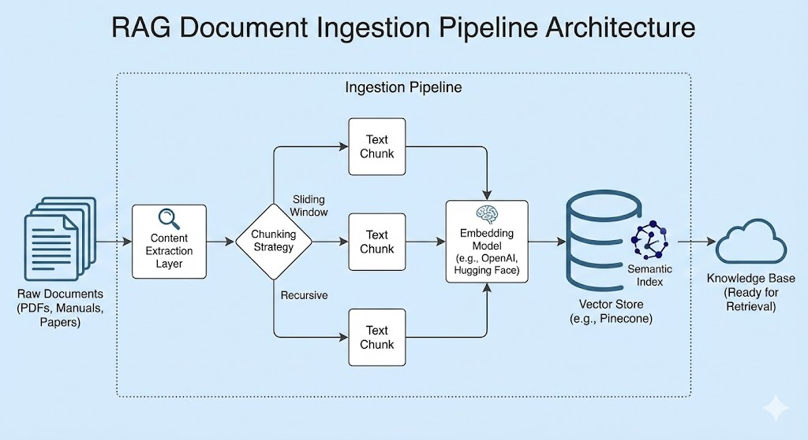

# Semantic Document Ingestion & Knowledge Base

Before getting started...
This readme file walks you through the basic architecture of this model.

* For how to get started refer [Set up file](./docs/setup.md)
* For the tools used refer [tools and libraries](./docs/toolsandlib.md)
* For details of the model used refer [model info](./model/modelinfo.md)

The primary aim of this project is to create a chatbot that ingests raw PDF as input and transforms then into a structured queryable knowledge base. By converting unstructured text into high-dimensional vector embeddings, this system enables context-aware search and retrieval for downstream LLM (Large Language Model) applications, such as RAG (Retrieval-Augmented Generation) chatbots.

## Architecure and Worklfow

The pipeline follows a standard "unstructured-to-structured" data flow. It is designed to handle large-scale document collections, ensuring that long-form text is preserved with semantic integrity.

## Detailed Architecture Breakdown

1. Document Ingestion Layer
    Input: Accepts a directory of PDF files (e.g., technical manuals, research papers, legal contracts).

    Action: Iterates through the source directory to identify valid file formats for processing.

2. Content Extraction
    Action: Parses the binary PDF format to extract raw text.

    Cleaning: Removes artifacts such as headers, footers, and page numbers to ensure only core content is processed.

3. Semantic Chunking
    Concept: Large documents cannot be processed by embedding models in a single pass due to token limits.

    Action: The text is split into smaller Text Chunks.

    Strategy: Uses overlapping windows (e.g., 512 tokens with 50-token overlap) or recursive character splitting to ensure context is not lost at the boundaries of chunks.

4. Embedding Generation

    Action: Each text chunk is passed to an Embedding Model (e.g., OpenAI text-embedding-3, Hugging Face all-MiniLM-L6-v2).

    Output: The model outputs a Vector Embedding—a dense list of floating-point numbers representing the semantic meaning of that specific chunk.

5. Index Construction

    Action: The system aggregates the generated vectors and prepares them for upsertion.

    Metadata: Essential metadata (e.g., Source Filename, Page Number, Chunk ID) is attached to each vector to allow for precise citations during retrieval.

6. Vector Persistence (Knowledge Base)

    Destination: Pinecone Vector Database.

    Outcome: The vectors are indexed for fast Approximate Nearest Neighbor (ANN) search, serving as the long-term memory for your application
